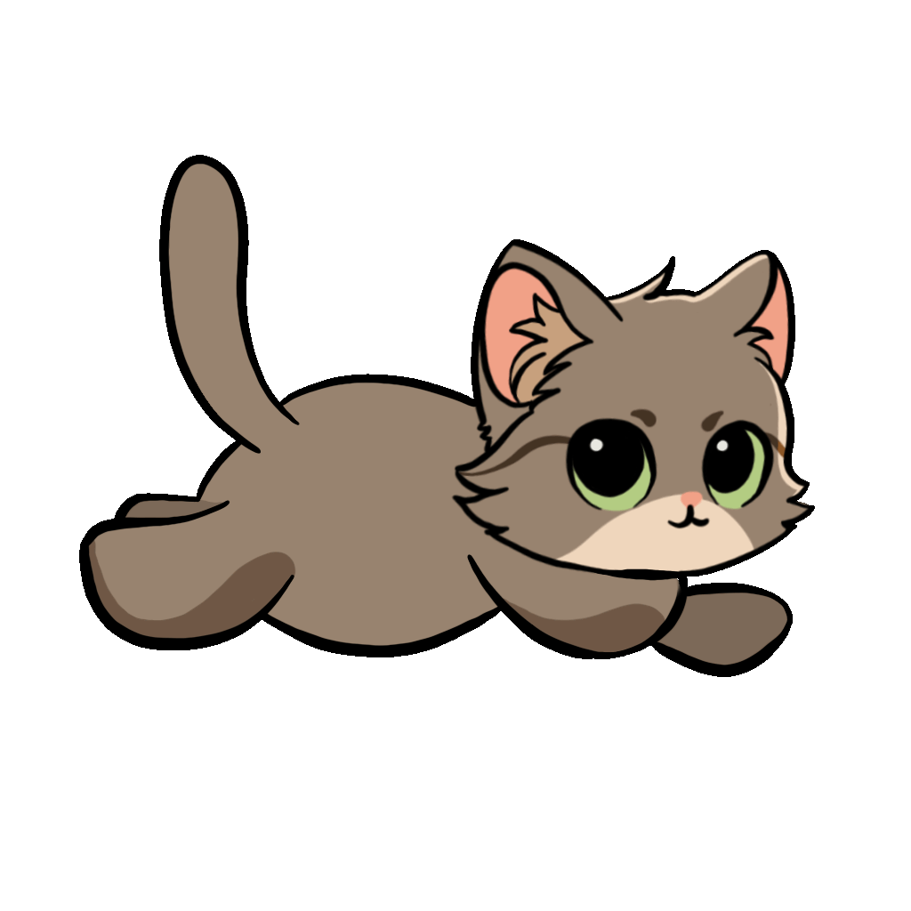
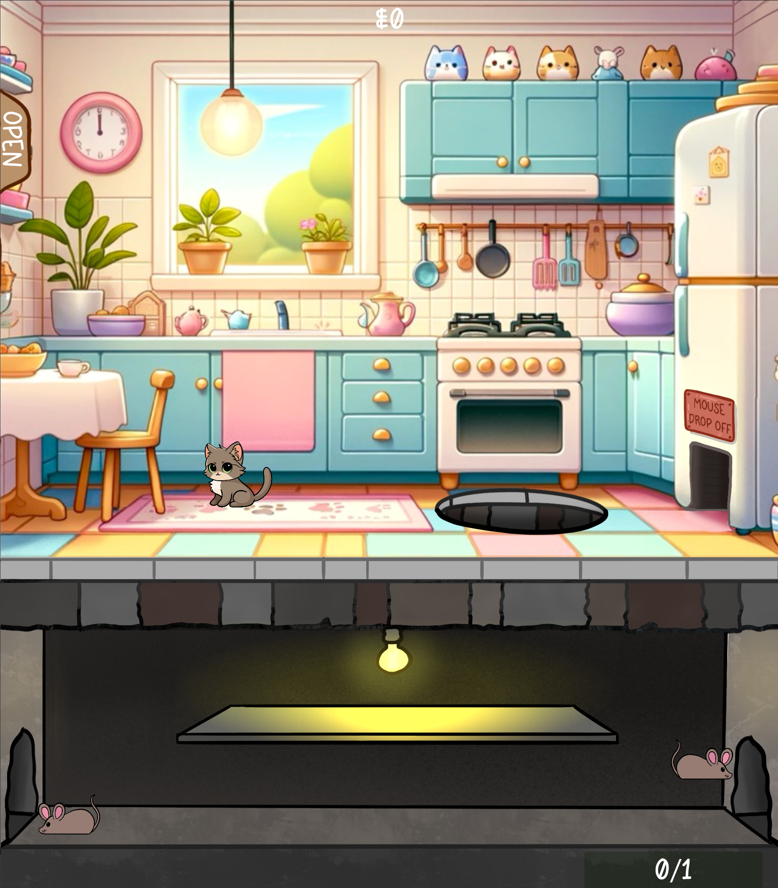
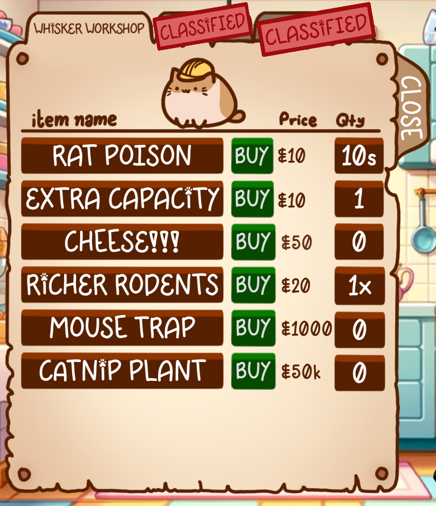
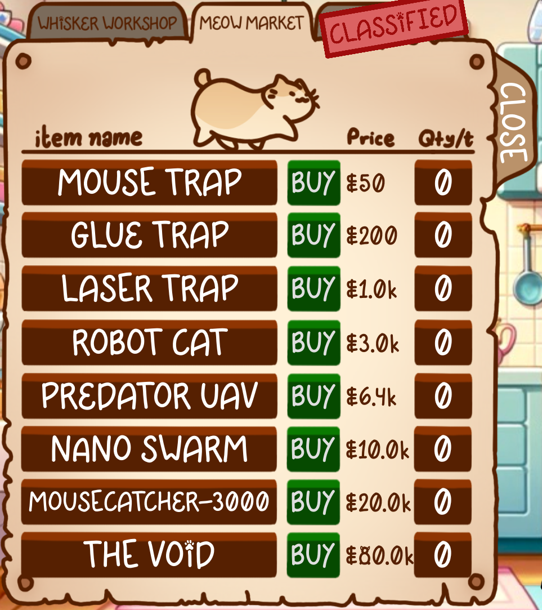
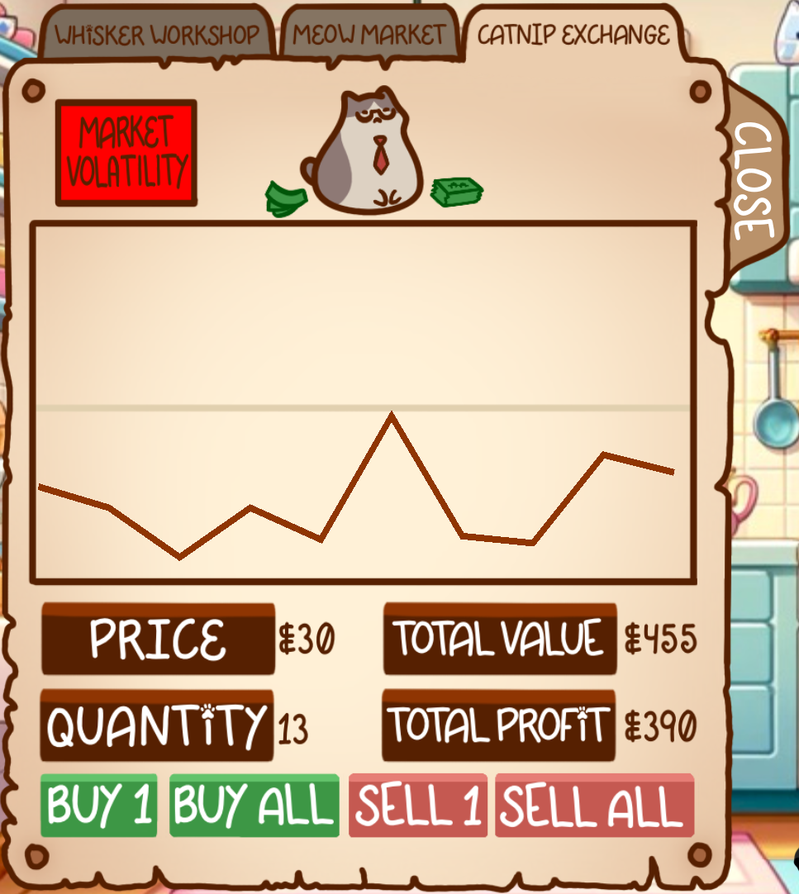

# Catnip Crusaders  

## Background

Welcome to "Catnip Crusaders," a delightful and engaging game where you step into the paws of a clever cat on a mission to catch mice! This game is a mix of active interaction and idle strategy, perfect for players who enjoy a balance of hands-on gameplay and passive progression. As you excel in your mouse-catching skills, you'll unlock various markets and shops, enriching your journey. The ultimate goal? Reach $10,000,000 cat cash to win the game! 

"Catnip Crusaders" was developed as a birthday present for my sister, complete with original music and art (minus some sound effects). It was developed in .NET Godot using C#, and was a fun project into learning Godot and developing a more in-depth knowledge of C#. 

## Features

- **Engaging Gameplay:** Switch between actively catching mice and strategically upgrading your abilities.
- **Progression System:** Unlock markets and shops as you accumulate points.
- **Original Art and Music:** Enjoy unique visuals and soundtracks created specifically for this game.
- **Idle Game Mechanics:** Perfect for players who enjoy a mix of active and passive gameplay.

### Main Screen

### Item Shops

## Installation

To play "Catnip Crusaders," simply download the latest file from the [releases section](https://github.com/apjp072/CatnipCrusaders/releases).

## License

This project is made available under the [MIT License](https://opensource.org/licenses/MIT).

## Acknowledgments

Special thanks to the various sources of sound effects used in the game, enriching the overall experience. Also, a big shoutout to my sister, whose I made this game for. 
